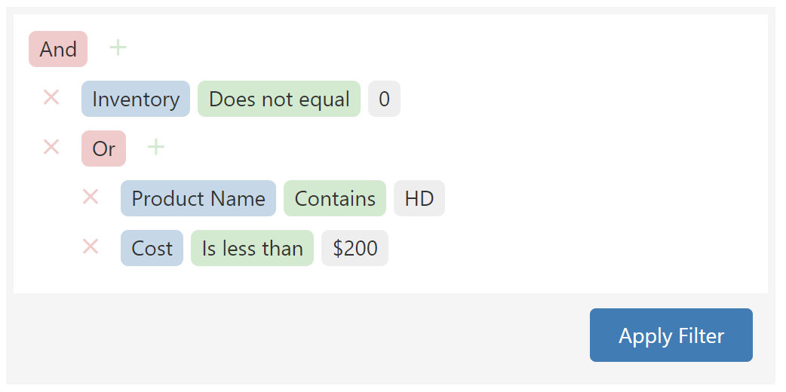
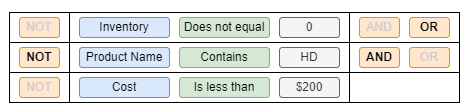
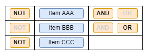
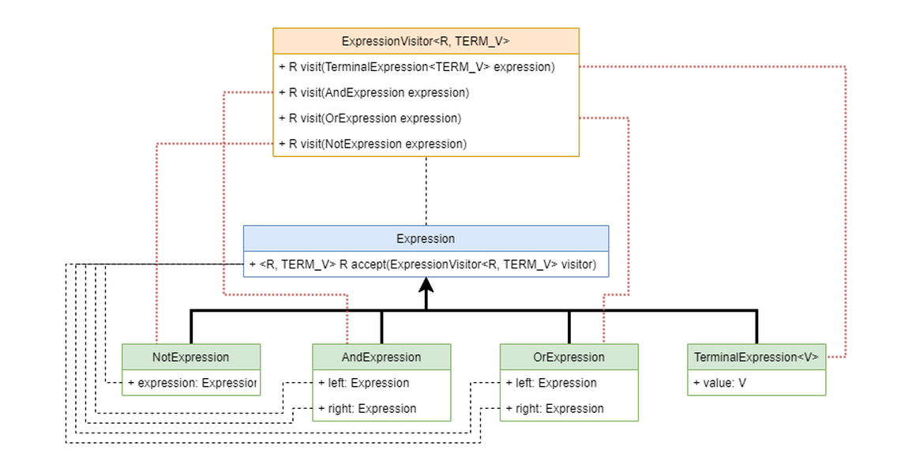

# Boolean expression evaluated, converted and persisted to MSSQL hiearchyid data type

Let's say that we have the following business problem we want to solve.
In hypothetical application we want to allow user to define some kind of filter where he/she can define boolean logical
expressions like AND/OR/NOT.

You can find UI/UX concept from **DevExpress Filter
editor** [demo page](https://js.devexpress.com/Demos/WidgetsGallery/Demo/FilterBuilder/WithDataGrid/jQuery/Light/).



This tree structure completely conform logical operator priorities definition and allow us to define arbitrary logical
structure.

It can be rewritten to for example SQL WHERE statement like:

```sql
WHERE Inventory <> 0 AND (ProductCode LIKE '%HD%' OR Cost < 200.0)
```

We can also have more light UI/UX which is, in contract, unable to express full boolean logic operators priorities.



It can be rewritten to for example SQL WHERE statement like:

```sql
WHERE Inventory <> 0 OR NOT ProductCode LIKE '%HD%' AND Cost < 200.0
```

Below we also show how to define another type of boolean expression where we only know `true`/`false` values of various
items.



```sql
WHERE NOT ItemAAA AND ItemBBB OR NOT ItemCCC
```

When we explicitly add parentheses to show operator priorities result would be like this:

```sql
WHERE ((NOT ItemAAA) AND ItemBBB) OR (NOT ItemCCC)
```

From observation of how simple UI works, we can see that we are unable to define there expression like following WHERE
clause. We can change operator priorities only by using parentheses, and we are not able to define them here. We can
define parentheses only in UI tree filter as described at beginning of this description.

```sql
WHERE ItemAAA AND (ItemBBB OR ItemCCC)
```

## Technical description

What is purpose of this repository:

- Show how to expose REST API of simple-ui
- Persist expression with arbitrary structure to DB using
  MSSQL [hierarchyid](https://docs.microsoft.com/en-us/sql/t-sql/data-types/hierarchyid-data-type-method-reference?view=sql-server-ver15)
  data type
- Convert fact expressions (like `A > 10 AND X = 'foo'`) to SQL WHERE clause

Note: Before starting Spring Boot's application, start MSSQL DB by running `docker compose up` command.

### MSSQL hierarchyid data type

Whe we have graph like or tree like structures, and we want to persist them into relation database, one of the options
is to create recursive DB tables structure and save data there.

One of the interesting features of MSSQL and ability to save data to tree like structure is to
use [hierarchyid](https://docs.microsoft.com/en-us/sql/t-sql/data-types/hierarchyid-data-type-method-reference?view=sql-server-ver15)
data type.

You can read documentation but usage is pretty simple and following example shows how it works.

```sql
CREATE TABLE SimpleDemo
(
    Level        hierarchyid NOT NULL,
    Location     nvarchar(30) NOT NULL,
    LocationType nvarchar(9) NULL
);

SELECT CAST(Level AS nvarchar(100)) AS [Converted Level], *
FROM SimpleDemo
ORDER BY Level;  
```

When we have sample data int `SimpleDemo` table, result of query above can be following.

```text
Converted Level  Level     Location         LocationType  
/1/              0x58      Europe           Continent  
/1/1/            0x5AC0    France           Country  
/1/1/1/          0x5AD6    Paris            City  
/1/2/            0x5B40    Spain            Country  
/1/2/1/          0x5B56    Madrid           City  
/2/              0x68      South America    Continent  
/2/1/            0x6AC0    Brazil           Country  
/2/1/1/          0x6AD6    Brasilia         City  
/2/1/2/          0x6ADA    Bahia            State  
/2/1/2/1/        0x6ADAB0  Salvador         City  
/3/              0x78      Antarctica       Continent  
/3/1/            0x7AC0    McMurdo Station  City  
```

### Internal expression AST

Because we have on one side REST API for simple-ui and on other side we have DB table with `hierarchyid` column, we need
some intermediate structure that can be easily used to query, create, and convert.

We should not try to reinvent our own new concept, but we can utilise AST
aka [Abstract Syntax Tree](https://en.wikipedia.org/wiki/Abstract_syntax_tree) data structure.

Our simple grammar and tree can be described as follows.

```antlrv4
Expression
 : NOT expression                           # NotExpression
 | left=expression AND right=expression     # AndExpression
 | left=expression OR right=expression      # OrExpression
 | TERM                                     # TerminalExpression
 ;
```



Using `ExpressionVisitor` class implementations we can easily process this tree structure
using [Visitor design pattern](https://en.wikipedia.org/wiki/Visitor_pattern).

### Conversion between flat structure and AST tree structure

Because we use simple-ui approach described above we are forced to convert between AST with proper logical operator
priorities defined and between simple REST API JSON array.

Let's take a look how flat REST API looks like.

```text
array
 : item+
 ;
 
item:
 {
  "leftOperator": NOT | null
  "value": ...
  "rightOperator": AND | OR 
                   | null (if last item of array)
 }
```

JSON example:

```json
[
  {
    "leftOperator": null,
    "value": 123,
    "rightOperator": "AND"
  },
  {
    "leftOperator": "NOT",
    "value": 456,
    "rightOperator": "OR"
  },
  {
    "leftOperator": null,
    "value": 789,
    "rightOperator": null
  }
]
```

#### Flat JSON array to AST

For conversion from flat JSON array to AST we use `RestDtoToExpressionConverter` class.

**First** it takes JSON array objects with definition of `leftOperator` and `rightOperator` and creates Boolean logic
string
that contains operators `AND`, `OR`, and `NOT` without explicit operator precedence defined by parentheses.

Values are replaced with Identifier definitions that are unique and can be parsed by ANTLR4 defined grammar
(see `./src/main/antlr4/SimpleBoolean.g4` file).

Example above is converted to string `X1 AND NOT X2 OR X3`.

**Second** ANTLR4 generated parser is used to parse string above and `StringToExpressionParser` is used to convert
ANTLR4 AST to our internal `Expression` AST.

We use `VariableExpression` terminal nodes to identify items in flat JSON array.

**Lastly** we use `RestDtoReplaceVariablesVisitor` to replace variables (like `X1`, `X2`, `X3`, etc) in terminal nodes
with actual values from JSON array.

#### AST to flat JSON array

For conversion from AST expression to flat JSON array we use `ExpressionToRestDtoConverter` class.

**First** it uses `FlattenExpressionVisitor` to create list of string tokens (it contains `AND`/`OR`/`NOT` and
identifier) and index between generate identifier and value from terminal node.

Let's say we have following AST:

```text
123 AND 456 OR NOT 789
(OR
 (AND
  123
  456
 )
 (NOT
  789
 )
)
```

It is translated to list of tokens:

```text
["[X1]", "AND", "[X2]", "OR", "NOT", "[X3]"]
```

Note: Token have `[` and `]` suffix/prefix for us to distinguish between operators and token identifiers.

It also creates index map:

```text
{
 "X1": 123,
 "X2": 456,
 "X3": 789 
}
```

**Second** we find identifiers indexes in token list. They will be items in flat JSON array.

**Lastly** we iterate this identifiers index and at every position we

- **look behind** current identifier token - to see if there is `NOT` operator defined
- **look ahead** current identifier token - to see if there is `AND` or `OR` operator defined.

From this information we create flat JSON array items with `leftOperator` and `rigthOperator` JSON properties defined.

Result of example above would be:

```json
[
  {
    "leftOperator": null,
    "value": 123,
    "rightOperator": "AND"
  },
  {
    "leftOperator": null,
    "value": 456,
    "rightOperator": "OR"
  },
  {
    "leftOperator": "NOT",
    "value": 789,
    "rightOperator": null
  }
]
```

### Implemented features

REST API Features:

- REST Endpoint for create/update/get `Fact` entity
- REST Endpoint for create/update/get `Id` entity
- Convert REST DTO flat structure to `Expression` AST
    - see `RestDtoToExpressionConverter` class
    - see `FlattenExpressionVisitor` class
- Convert `Expression` AST to REST DTO flat structure
    - see `ExpressionToRestDtoConverter` class
    - see `RestDtoReplaceVariablesVisitor` class

DB features:

- DB Repository for working with
  MSSQL [hierarchyid](https://docs.microsoft.com/en-us/sql/t-sql/data-types/hierarchyid-data-type-method-reference?view=sql-server-ver15)
  data type
    - see `FactExpressionRepository` class
    - see `IdExpressionRepository` class
- Convert DB entity to `Expression` AST
    - see `DefinitionToExpressionConvertor` base class
- Convert `Expression` AST to DB entity
    - see `ExpressionToDefinitionConverter` base class
- Convert `Fact` expression AST to SQL WHERE statement using [JSqlParser](https://github.com/JSQLParser/JSqlParser)
    - see `SqlGeneratorVisitor` class

DB Structure `Fact` rich data:

```sql
create table foo.EXPRESSION_FACT_ITEM
(
    ID               int identity constraint PK_EXPRESSION_FACT_ITEM primary key,
    PARENT_ID        int         not null,
    HIERARCHY        hierarchyid not null,
    TYPE             varchar(14) not null,
    LOGICAL_OPERATOR varchar(8),
    VAL_COLUMN_NAME  varchar(64),
    VAL_OPERATOR     varchar(64),
    VAL_VALUE        clob
)
```

DB Structure `Id` simple `int` artificial relation:

```sql
create table foo.EXPRESSION_ID_ITEM
(
    ID               int identity constraint PK_EXPRESSION_ID_ITEM primary key,
    PARENT_ID        int         not null,
    HIERARCHY        hierarchyid not null,
    TYPE             varchar(14) not null,
    LOGICAL_OPERATOR varchar(8),
    VAL_ID           int
)
```

Other features:

- Parse logical expression string without parentheses to detect implicit operator precedence
    - see `StringToExpressionParser` class
    - [ANTLR](https://www.antlr.org/) grammar `SimpleBoolean.g4`

---

TODO

- [ ] Testcontainers test
- [ ] REST API tree structure
